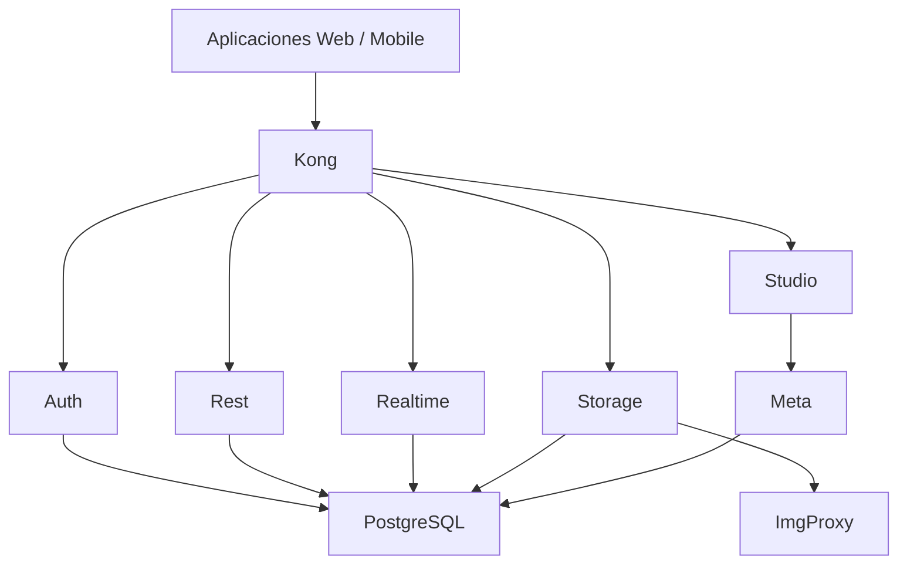

# 🚀 Supabase Local Self-Hosted con Docker

## 📌 Descripción

Este repositorio contiene la guía para ejecutar una instancia de Supabase completamente self-hosted en local usando Docker Compose.

La solución incluye los componentes principales de Supabase:

- PostgreSQL
- Realtime (WebSockets)
- Auth (GoTrue)
- PostgREST
- Storage
- ImgProxy
- Postgres Meta
- Studio
- Kong API Gateway

> Ideal para entornos de desarrollo, pruebas y demostraciones locales.

---

## 📦 Estructura recomendada

```bash
supabase/
├── docker-compose.yml
├── .env
├── kong.yml
├── volumes/
├── postgres/
│   └── storage/
└── backups/
```

---

## ⚙️ Requisitos

- Docker
- Docker Compose
- Git
- Node.js (opcional, solo si quieres ejecutar scripts extra)

---

## 🌐 Diagrama de arquitecturá



---

## 🔧 Variables de entorno

Crea un archivo `.env` con los valores necesarios.

```env
# PostgreSQL
POSTGRES_DB=postgres
POSTGRES_PORT=5432
POSTGRES_PASSWORD=SuperPassword123

# JWT
JWT_SECRET=CAMBIAR_POR_UN_SECRET_DE_32_CARACTERES
JWT_EXPIRY=3600

# API KEYS
ANON_KEY=GENERAR_ANON_KEY
SERVICE_ROLE_KEY=GENERAR_SERVICE_ROLE_KEY

# Realtime
SECRET_KEY_BASE=GENERAR_SECRET_KEY_BASE

# Meta
PG_META_CRYPTO_KEY=GENERAR_CRYPTO_KEY

# URLs
SITE_URL=http://localhost:3000
API_EXTERNAL_URL=http://localhost:8000
SUPABASE_PUBLIC_URL=http://localhost:8000
ADDITIONAL_REDIRECT_URLS=http://localhost:3000

# Studio
STUDIO_ORG=ALCORE
STUDIO_PROJECT=Supabase Local

# Kong
KONG_HTTP_PORT=8000
```

> Cambia todos los valores de clave y secretos antes de usarlo en un entorno que no sea de desarrollo.

---

## ▶️ Cómo iniciar el proyecto

1. Clona el repositorio.
2. Copia el ejemplo de variables de entorno y ajusta los valores.
3. Ejecuta:

```bash
docker compose up -d
```

4. Verifica que los contenedores estén activos:

```bash
docker compose ps
```

---

## 🧩 Servicios principales

### PostgreSQL

- Motor de base de datos principal.
- Almacena usuarios, datos de negocio, políticas RLS, eventos Realtime y metadatos de Storage.

### Realtime

- Permite conexiones WebSocket.
- Sincroniza datos en tiempo real.
- Ideal para chats, dashboards en vivo y notificaciones instantáneas.

### Auth

- Gestión de autenticación, registro, recuperación de contraseña y JWT.
- Expone el servicio de GoTrue para login y autorización.

### REST API (PostgREST)

- Genera automáticamente endpoints REST desde tu base de datos PostgreSQL.
- Usa JWT para validar el acceso.

### Storage

- Guarda archivos estáticos como imágenes, PDFs y videos.
- Administra buckets y permisos desde Supabase Studio.

### ImgProxy

- Optimiza imágenes en tiempo real.
- Soporta WebP, resize y thumbnails.

### Postgres Meta

- Brinda soporte para administración de metadatos desde Studio.
- Usa el servicio de meta para la interfaz gráfica.

### Studio

- Interfaz gráfica de Supabase.
- Permite crear tablas, ejecutar SQL, configurar reglas y gestionar Storage.

### Kong

- Gateway de entrada principal.
- Enruta solicitudes hacia Auth, REST, Realtime, Storage y Studio.

---

## ✅ Buenas prácticas

- No uses secretos visibles en producción.
- Mantén el archivo `.env` fuera del control de versiones.
- Cambia las claves `JWT_SECRET`, `ANON_KEY`, `SERVICE_ROLE_KEY` y `SECRET_KEY_BASE` por valores seguros.

---

## 📌 Notas finales

Este README está pensado para que el proyecto sea fácil de entender y desplegar localmente. Si quieres, puedo ayudarte también a crear un `docker-compose.yml` de ejemplo para esta arquitectura.
